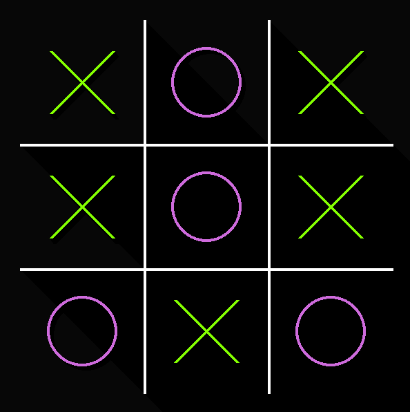

# Jogo da Velha Minimalista

<!-- LOGO -->

  
  <h3 align="center">Um simples jogo da velha minimalista</h3>
  

    <a href ="https://youtu.be/6DaKhVFMZ34">
      Video de demonstração!
    </a>
  

<!-- TABELA DE CONTEUDO -->

  
Conteúdos

  <ol>
    <li>
      <a href="#sobre-o-projeto">Sobre o Projeto</a>
      <ul>
        <li><a href="#criado-com">Criado com</a></li>
      </ul>
      <ul>
        <li><a href="#regras">Regras</a></li>
      </ul>
      <ul>
        <li><a href="#exemplos">Exemplos</a></li>
      </ul>
    </li>
    <li>
      <a href="#como-utilizar">Como utilizar</a>
      <ul>
        <li><a href="#download">Download</a></li>
      </ul>
      <ul>
        <li><a href="#comandos">Comandos</a></li>
      </ul>
    </li>
  </ol>

  

# Sobre o Projeto

** descrição aqui **

## Criado com

O pacote [PyGame](https://www.pygame.org/) foi utilizado para o desenvolvimento de toda a interface gráfica deste projeto.

## Regras

** regras aqui **

## Exemplos

* Paleta Café

* Paleta Chiclete

* Paleta Fast Food

* Paleta Coringa

* Paleta Melancia

# Como utilizar

## Download

O Download do executavel para Windows pode ser obtido neste link: 

https://github.com/IgorSolerC/jogo-da-velha-minimalista/releases

Para usuarios de outros sistemas operacionais:
* Instale a linguagem Python

  https://www.python.org/

* Instale o PyGame

  Digite em seu prompt de comando o seguite comando.

  `pip install pygame`
 
* Clone o repositório
 
* Abra o arquivo main.pyw

## Comandos

* Coloca peça (BEM)

  Em seu turno, aperte com o botão esquerdo do mouse em cima de um quadrado desocupado do tabuleiro para colocar a sua peça neste lugar. 

* Mudar cor selecionada (1)

  Aperte a tecla 1 para alterar a paleta de cores selecionada.

* Remover/Adicionar sombras (2)

  Aperte a tecla 2 para remover/adicinar sombras no tabuleiro.
